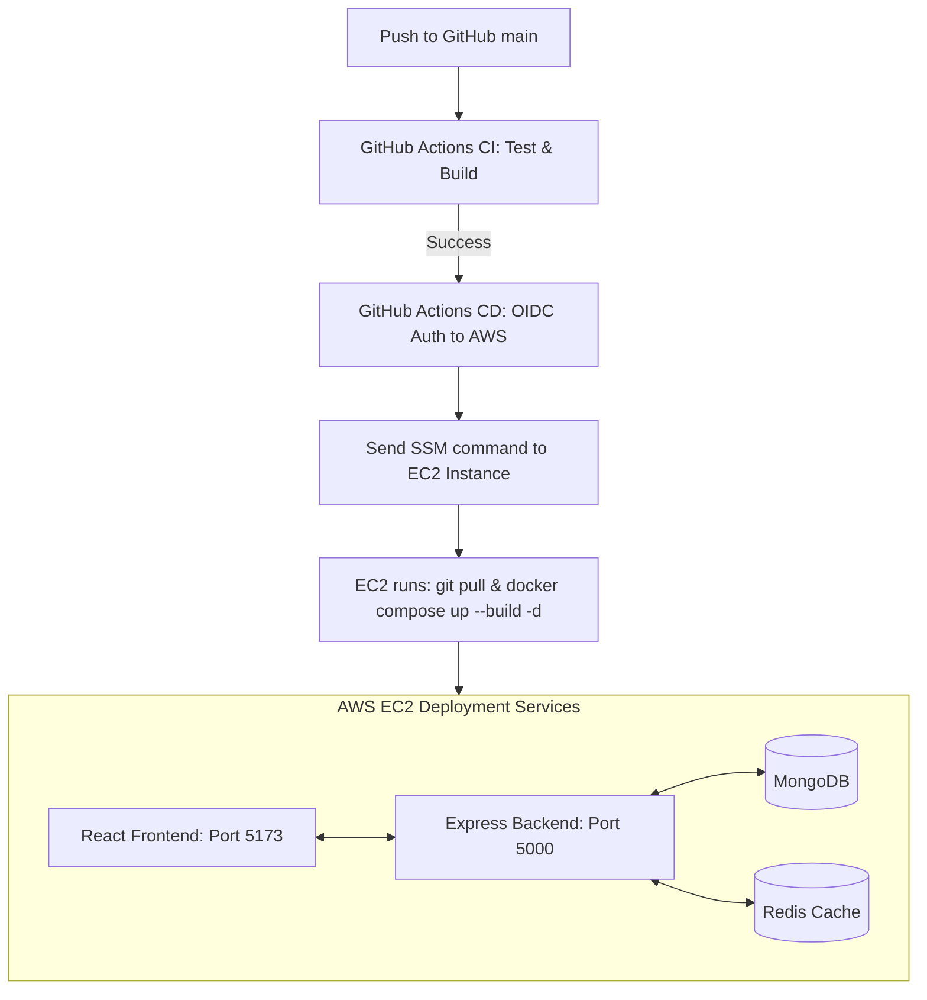

# CosmicShort — Modern URL Shortener & Analytics

CosmicShort is a high-performance, containerized URL shortening application built using React (Vite), Express.js, MongoDB, and Redis. It is designed to run in Docker containers and is deployed continuously to AWS EC2 via GitHub Actions.

---

## 🚀 Key Features

* **Instant Link Shortening**: Shorten long URLs with or without username prefixes.
* **Custom Aliases**: Brand your links with custom short codes (e.g., `cosmic.short/my-promo`).
* **Redis Caching**: High-throughput redirection caching with Redis for sub-millisecond response times.
* **Real-Time Click Tracking**: Real-time click counters utilizing atomic Redis increments before syncing or displaying.
* **Link Management Dashboard**: A premium, glassmorphic dark-theme console to manage your links, check creation timestamps, and view live click analytics.
* **Robust Error Handling**: Friendly translations of backend messages, validator guards, and server offline notices.

---

## 🛠️ Technology Stack

* **Frontend**: React 19 (Vite), Axios, Custom CSS (Dark Theme design system).
* **Backend**: Node.js & Express.js.
* **Database**: MongoDB (persistent URL & user records).
* **Caching & Analytics**: Redis (caching URL locations and click counters).
* **Containerization**: Docker & Docker Compose.
* **Cloud Infrastructure**: Amazon Web Services (AWS EC2, AWS Systems Manager - SSM).
* **CI/CD Pipeline**: GitHub Actions (`ci.yml` and `cd.yml`).

---

## ⚙️ System Architecture & CI/CD Flow



---

## 📂 Project Structure

```text
URLShortener/
├── backend/
│   ├── src/
│   │   ├── config/          # DB & Redis connection setups
│   │   ├── controllers/     # Route business logic (auth, url)
│   │   ├── middleware/      # Auth validator token checkers
│   │   ├── model/           # MongoDB schemas
│   │   └── routes/          # API endpoint routes
│   └── Dockerfile
├── frontend/
│   ├── src/
│   │   ├── page/            # React pages (Home, Login, Register, Dash)
│   │   ├── App.jsx          # Route switcher configuration
│   │   └── index.css        # Premium custom dark stylesheet
│   └── Dockerfile
├── .github/
│   └── workflows/           # CI/CD pipeline actions (ci.yml, cd.yml)
├── docker-compose.yml       # Orchestrated multi-container config
└── README.md
```

---

## 🔧 Environment Configuration

Create a `.env` file in the root directory:

```env
# Server base settings
BASE_URL=http://localhost:5000
VITE_API_URL=http://localhost:5000

# Authentication secrets
JWT_SECRET=change_me_to_something_secure
JWT_EXPIRES_IN=7d
```

---

## 💻 Local Setup & Run

### 🐳 Run using Docker Compose (Recommended)

1. Make sure you have Docker and Docker Compose installed.
2. Spin up all services (MongoDB, Redis, Backend, Frontend) with a single command:
   ```bash
   docker compose up --build
   ```
3. Access the services:
   * **Frontend**: [http://localhost:5173](http://localhost:5173)
   * **Backend API**: [http://localhost:5000](http://localhost:5000)

---

### 🛠️ Manual Installation (Without Docker)

#### 1. Pre-requisites
* Install Node.js (v18 or higher).
* Ensure MongoDB is running locally on port `27017`.
* Ensure Redis Server is running locally on port `6379`.

#### 2. Run Backend
```bash
cd backend
npm install
npm run dev
```

#### 3. Run Frontend
```bash
cd frontend
npm install
npm run dev
```
Open [http://localhost:5173](http://localhost:5173) in your browser.

---

## 📡 API Documentation

### 🔐 Authentication Endpoints

#### Register a New User
* **Endpoint**: `POST /api/auth/register`
* **Body**:
  ```json
  {
    "name": "Full Name",
    "email": "user@domain.com",
    "username": "kittu",
    "password": "secretpassword"
  }
  ```

#### Login User
* **Endpoint**: `POST /api/auth/login`
* **Body**:
  ```json
  {
    "username": "kittu",  // or "email": "user@domain.com"
    "password": "secretpassword"
  }
  ```
* **Response**: Returns JWT token: `{ token, username, email }`

---

### 🔗 URL Shortener Endpoints

#### Shorten URL
* **Endpoint**: `POST /api/urls/shorten`
* **Headers**: `Authorization: Bearer <token>`
* **Body**:
  ```json
  {
    "originalUrl": "https://google.com",
    "customAlias": "my-alias",      // Optional custom short-code
    "withUsername": false           // Optional prefix with username
  }
  ```

#### Get My URLs
* **Endpoint**: `GET /api/urls/my`
* **Headers**: `Authorization: Bearer <token>`
* **Response**: List of URLs created by the authenticated user.

#### Get Link Statistics
* **Endpoint**: `GET /api/urls/:shortCode/stats`
* **Response**: Clicks, creation timestamp, expiration details, isCustom flags. (Click counts incremented via Redis caches are merged automatically).

#### Redirect Short URL
* **Endpoint**: `GET /:shortCode`
* **Behavior**: Permanently redirects client to the destination URL. Checks Redis cache first.
